# DCC Library Class Diagram

```mermaid
classDiagram
    direction TB

    %% ── DccPkt inheritance hierarchy ──────────────────────────

    class DccPkt {
        #uint8_t _msg[8]
        #int _msg_len
        +DccPkt(msg, msg_len)
        +get_type() PktType
        +get_address() int
        +set_address(adrs) int
        +set_xor()
        +check_xor() bool
        +decode_speed_128(speed) bool
        +decode_func_0(f) bool
        +dump(buf, buf_len) char*
        +show(buf, buf_len) char*
        +decode_type(msg, msg_len)$ PktType
    }

    class DccPktIdle {
        +DccPktIdle()
        +get_type() PktType
    }

    class DccPktReset {
        +DccPktReset()
        +get_type() PktType
    }

    class DccPktSpeed128 {
        +DccPktSpeed128(adrs, speed)
        +get_speed() int
        +set_speed(speed)
        +set_address(adrs) int
        +int_to_dcc(speed)$ uint8_t
        +dcc_to_int(speed)$ int
    }

    class DccPktFunc0 {
        +DccPktFunc0(adrs)
        +get_f(num) bool
        +set_f(num, on)
        +set_address(adrs) int
    }

    class DccPktFunc5 {
        +DccPktFunc5(adrs)
        +get_f(num) bool
        +set_f(num, on)
    }

    class DccPktFunc9 {
        +DccPktFunc9(adrs)
        +get_f(num) bool
        +set_f(num, on)
    }

    class DccPktFuncHi~i_byte, f_min~ {
        +DccPktFuncHi(adrs)
        +get_f(num) bool
        +set_f(num, on)
        +set_address(adrs) int
    }

    class DccPktReadCv {
        +DccPktReadCv(adrs, cv_num)
        +set_cv(cv_num)
        +set_address(adrs) int
    }

    class DccPktWriteCv {
        +DccPktWriteCv(adrs, cv_num, cv_val)
        +set_cv(cv_num, cv_val)
        +set_address(adrs) int
    }

    class DccPktWriteBit {
        +DccPktWriteBit(adrs, cv_num, bit_num, bit_val)
        +set_cv_bit(cv_num, bit_num, bit_val)
        +set_address(adrs) int
    }

    class DccPktSvcWriteCv {
        +DccPktSvcWriteCv(cv_num, cv_val)
        +set_cv(cv_num, cv_val)
    }

    class DccPktSvcWriteBit {
        +DccPktSvcWriteBit(cv_num, bit_num, bit_val)
        +set_cv_bit(cv_num, bit_num, bit_val)
    }

    class DccPktSvcVerifyCv {
        +DccPktSvcVerifyCv(cv_num, cv_val)
        +set_cv_num(cv_num)
        +set_cv_val(cv_val)
    }

    class DccPktSvcVerifyBit {
        +DccPktSvcVerifyBit(cv_num, bit_num, bit_val)
        +set_cv_num(cv_num)
        +set_bit(bit_num, bit_val)
    }

    DccPkt <|-- DccPktIdle
    DccPkt <|-- DccPktReset
    DccPkt <|-- DccPktSpeed128
    DccPkt <|-- DccPktFunc0
    DccPkt <|-- DccPktFunc5
    DccPkt <|-- DccPktFunc9
    DccPkt <|-- DccPktFuncHi~i_byte, f_min~
    DccPkt <|-- DccPktReadCv
    DccPkt <|-- DccPktWriteCv
    DccPkt <|-- DccPktWriteBit
    DccPkt <|-- DccPktSvcWriteCv
    DccPkt <|-- DccPktSvcWriteBit
    DccPkt <|-- DccPktSvcVerifyCv
    DccPkt <|-- DccPktSvcVerifyBit

    %% ── DccPktFuncHi aliases ──────────────────────────────────

    note for DccPktFuncHi~i_byte, f_min~ "Aliases:\nDccPktFunc13 = DccPktFuncHi<0xde,13>\nDccPktFunc21 = DccPktFuncHi<0xdf,21>\nDccPktFunc29 = DccPktFuncHi<0xd8,29>\n...through Func61"

    %% ── Controller classes ────────────────────────────────────

    class DccCommand {
        -DccBitstream _bitstream
        -DccAdc& _adc
        -Mode _mode
        -ModeSvc _mode_svc
        -list~DccLoco*~ _locos
        -DccPktReset _pkt_reset
        -DccPktSvcWriteCv _pkt_svc_write_cv
        -DccPktSvcWriteBit _pkt_svc_write_bit
        -DccPktSvcVerifyCv _pkt_svc_verify_cv
        -DccPktSvcVerifyBit _pkt_svc_verify_bit
        +set_mode_off()
        +set_mode_ops()
        +write_cv(cv_num, cv_val)
        +read_cv(cv_num)
        +svc_done(result, val) bool
        +mode() Mode
        +get_packet(pkt)
        +loop()
        +find_loco(address) DccLoco*
        +create_loco(address) DccLoco*
        +delete_loco(loco) DccLoco*
    }

    class DccLoco {
        -DccPktSpeed128 _pkt_speed
        -DccPktFunc0 _pkt_func_0
        -DccPktFunc5 _pkt_func_5
        -DccPktFunc9 _pkt_func_9
        -DccPktFunc13 _pkt_func_13
        -int _seq
        -DccPkt* _pkt_last
        -DccPktReadCv _pkt_read_cv
        -DccPktWriteCv _pkt_write_cv
        -DccPktWriteBit _pkt_write_bit
        +get_address() int
        +set_address(address)
        +get_speed() int
        +set_speed(speed)
        +get_function(func) bool
        +set_function(func, on)
        +read_cv(cv_num)
        +write_cv(cv_num, cv_val)
        +next_packet() DccPkt
        +railcom(msg, msg_cnt)
        +ops_done(result, value) bool
    }

    class DccBitstream {
        -DccCommand& _command
        -RailCom _railcom
        -DccPkt2 _current2
        -int _preamble_bits
        -uint _slice
        -int _byte_num
        -int _bit_num
        -bool _use_railcom
        +DccBitstream(command, sig_gpio, pwr_gpio, uart, rc_gpio)
        +start_ops()
        +start_svc()
        +stop()
        -prog_bit(b)
        -next_bit()
        -pwm_handler(arg)$
    }

    class DccPkt2 {
        -DccPkt _pkt
        -DccLoco* _loco
        +DccPkt2(pkt, loco)
        +set_pkt(pkt)
        +set_loco(loco)
        +get_loco() DccLoco*
        +len() int
        +data(idx) uint8_t
        +get_type() PktType
    }

    class DccAdc {
        -int _gpio
        -uint16_t _avg[166]
        -int _avg_idx
        +DccAdc(gpio)
        +start()
        +stop()
        +loop() bool
        +short_avg_ma() uint16_t
        +long_avg_ma() uint16_t
        +log_init(samples)
        +log_show()
    }

    class DccBit {
        -int _verbosity
        -BitState _bit_state
        -int _preamble
        -uint8_t _pkt[16]
        -int _pkt_len
        -pkt_recv_t* _pkt_recv
        +DccBit(verbosity)
        +edge(edge_us)
        +half_bit(half)
        +on_pkt_recv(pkt_recv)
        +to_half(d_us)$ int
    }

    %% ── RailCom classes ───────────────────────────────────────

    class RailCom {
        -uart_inst_t* _uart
        -int _rx_gpio
        -uint8_t _enc[8]
        -uint8_t _dec[8]
        -int _pkt_len
        -RailComMsg _ch1_msg
        -RailComMsg _ch2_msg[6]
        -int _ch2_msg_cnt
        +RailCom(uart, rx_gpio)
        +reset()
        +read()
        +parse()
        +get_ch2_msgs(msgs) int
    }

    class RailComMsg {
        +MsgId id
        +pom / ahi / alo / ext / dyn / xpom
        +parse1(d, d_end) bool
        +parse2(d, d_end) bool
        +show(buf, buf_len) int
        +id_name() char*
    }

    %% ── Composition / Aggregation relationships ──────────────

    DccCommand *-- DccBitstream : contains
    DccCommand o-- DccAdc : references
    DccCommand *-- "0..*" DccLoco : manages
    DccCommand *-- DccPktReset
    DccCommand *-- DccPktSvcWriteCv
    DccCommand *-- DccPktSvcWriteBit
    DccCommand *-- DccPktSvcVerifyCv
    DccCommand *-- DccPktSvcVerifyBit

    DccBitstream o-- DccCommand : calls get_packet()
    DccBitstream *-- RailCom : contains
    DccBitstream *-- DccPkt2 : current packet

    DccLoco *-- DccPktSpeed128
    DccLoco *-- DccPktFunc0
    DccLoco *-- DccPktFunc5
    DccLoco *-- DccPktFunc9
    DccLoco *-- DccPktFuncHi~i_byte, f_min~ : Func13-Func61
    DccLoco *-- DccPktReadCv
    DccLoco *-- DccPktWriteCv
    DccLoco *-- DccPktWriteBit

    DccPkt2 *-- DccPkt : wraps
    DccPkt2 o-- DccLoco : optional ref

    RailCom *-- "1" RailComMsg : ch1
    RailCom *-- "0..6" RailComMsg : ch2

    DccLoco ..> RailComMsg : processes
```

## Key Relationships

- **DccCommand** is the top-level controller. It owns a `DccBitstream` for PWM signal generation, manages a list of `DccLoco` objects (one per locomotive), and references a `DccAdc` for track current sensing.
- **DccBitstream** drives the PWM hardware. On each bit interrupt it calls back into `DccCommand::get_packet()` to get the next packet. It also owns a `RailCom` receiver for decoder feedback.
- **DccLoco** represents one locomotive. It holds a set of pre-built `DccPkt` subclass instances (speed, functions, CV ops) and round-robins through them via `next_packet()`.
- **DccPkt** is the base for all packet types. 14 subclasses cover speed, function groups (F0-F68 via a template), CV read/write in both ops and service modes.
- **DccPkt2** wraps a `DccPkt` with an optional `DccLoco*` back-pointer so the bitstream can route RailCom responses to the correct loco.
- **DccBit** is a standalone decoder for incoming DCC bitstreams (used in spy/monitoring tools, not in the main loco flow).
